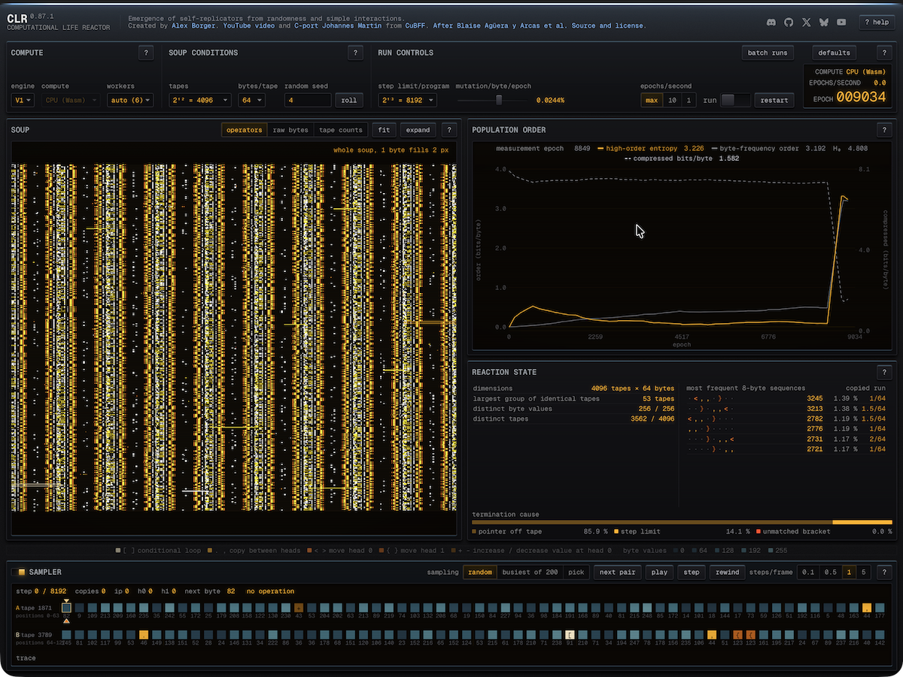

<p align="center">
  
</p>

# CLR — Computational Life Reactor

CLR is a browser environment for running and inspecting the computational-life
reactor described by Agüera y Arcas et al. It provides two independently
maintained C/Wasm engines: CLR's adaptation of Johannes Martin's Brainfuck-Life
port and CLR's direct CuBFF port. CuBFF can optionally execute through WebGPU.

The application runs locally in the browser and does not require a backend.
Reactor behavior and operator controls are documented in the application's
**? help** manual.

[]

## Web app link

[https://alexborger.com/clr-computational-life-reactor](https://alexborger.com/clr-computational-life-reactor)

## Requirements

- Node.js 24.12 or newer
- npm
- A current browser with WebAssembly and module workers
- Optional: WebGPU exposed to a module worker

The supported Node release is recorded in `.nvmrc`. Regenerating the embedded
Wasm modules additionally requires Zig on `PATH`; on macOS it can be installed
with `brew install zig`.

## Quick start

```sh
npm ci
npm run dev
```

The Vite development server is available at `http://localhost:5173` by default.
Select **I understand — start CLR** in the start window to initialize the
reactor.

## Commands

- `npm run dev` — start the application development server.
- `npm run build` — rebuild the native Wasm modules and create the production
  application.
- `npm run build:web` — create the production application using the checked-in
  Wasm modules.
- `npm run preview` — serve the production application locally.
- `npm run build:wasm` — compile and embed the native engines and Brotli
  measurement module.
- `npm run typecheck` — type-check the browser main-thread and worker targets.
- `npm run test:unit` — run the Vitest component, UI-store,
  runtime-boundary, and record-domain tests.
- `npm test` — run the hardware-independent conformance, regression, and unit
  suites using the checked-in Wasm modules.
- `npm run test:browser` — build and run the Playwright browser integration
  suite.
- `npm run verify` — regenerate Wasm, run all hardware-independent tests, and
  create the production application without regenerating Wasm a second time.

Browser tests require the pinned Chromium build once per Playwright version:

```sh
npx playwright install chromium
npm run test:browser
```

## Production deployment

`npm run build` writes a static, relative-path bundle to `appweb/dist/`.
Production source maps are disabled. The complete contents of that directory
may be published under any website directory without rebuilding or configuring
that directory name in CLR. The generated document derives its asset base from
the current URL, including when a host serves an extensionless directory route
without redirecting it to a trailing slash.

CLR constructs embedded WebAssembly modules and uses module workers. The
response Content Security Policy must therefore include:

```text
script-src 'self' 'sha256-Ylc0YraG5qwsufO5s4gxSVPW6AALKH2vBjsDoastoMs=' 'wasm-unsafe-eval';
worker-src 'self';
```

The hash authorizes only CLR's generated relative-base bootstrap; it does not
enable arbitrary inline scripts. Use the narrow `wasm-unsafe-eval` directive
rather than `unsafe-eval`. WebGPU
execution requires HTTPS in production; CPU/Wasm remains available when WebGPU
is unavailable.

## Documentation

- [Product](docs/0-Product.md) — experimental purpose, engine and compute-path
  behavior, observations, records, and failure semantics.
- [Architecture](docs/1-Architecture.md) — runtime structure, state ownership,
  concurrency, build pipeline, validation, security, and deployment.
- [Architecture visual schema](docs/2-Architecture-Visual-Schema.md) — compact
  execution and data-flow diagrams.
- [Roadmap](docs/3-Roadmap-Todo.md) — near-term work.
- [Ideas](docs/4-Roadmap-Ideas.md) — longer-term possibilities.
- [Version specifications](specs/) — reviewed historical feature definitions.

## Technical notes

- [Native engine notes](engine/native/README.md) — C-port provenance and
  browser-specific adaptations.
- [Development tools](tools/README.md) — Wasm generation, verification suites,
  and their ownership boundaries.
- [Example run parameters](examples/run-params-examples.txt) — observed
  configurations for reproducing exploratory runs.

## References

- Agüera y Arcas et al.,
  [_Computational Life: How Well-formed, Self-replicating Programs Emerge from
  Simple Interaction_](https://arxiv.org/abs/2406.19108)
- [`paradigms-of-intelligence/cubff`](https://github.com/paradigms-of-intelligence/cubff)
- [`mathelehrer/BrainFuckLife`](https://github.com/mathelehrer/BrainFuckLife)
- [`alexcybernetic/BrainFuckLife`](https://github.com/alexcybernetic/BrainFuckLife)

## Acknowledgements

Special thanks to [@mathelehrer](https://github.com/mathelehrer) and
[@lemonspurple](https://github.com/lemonspurple) for testing CLR over and over
again, and for all their support.

## License

Copyright (C) 2026 Alex Borger.

CLR's software is licensed under the [GNU General Public License v3.0 or
later](LICENSE). Third-party components and assets retain the licenses listed
in [Third-party notices](THIRD_PARTY_NOTICES.md).

## Community

- [Discord](https://discord.gg/ry9f98PTUE)
